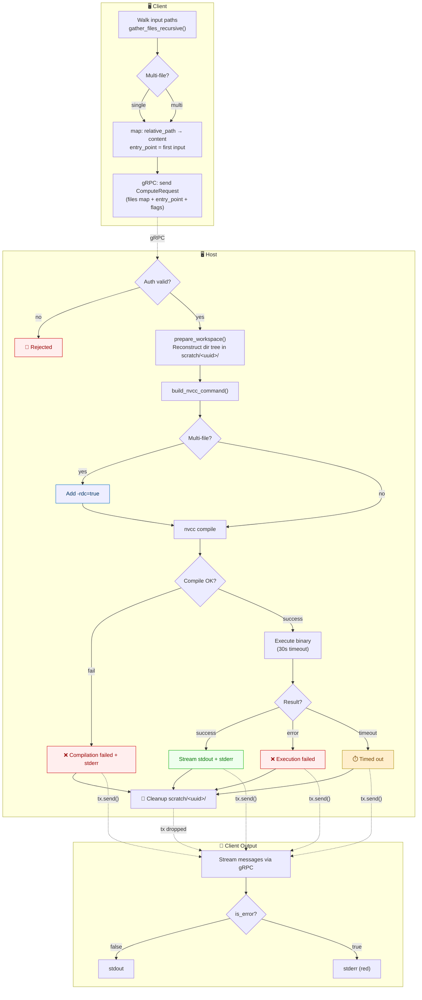

# 📄 Architecture: Host Execution Engine

**Files:** [crates/host/src/main.rs](/crates/host/src/main.rs) · [crates/host/src/utils.rs](/crates/host/src/utils.rs)

The Host is the GPU-side daemon that receives a workspace of CUDA source files over gRPC, compiles them with `nvcc`, executes the resulting binary, and streams output back to the client in real time. It is also responsible for authentication gating and GPU telemetry.

## End-to-End Execution Flow



---

## File Layout

| File | Responsibility |
|---|---|
| `main.rs` | gRPC service implementation, job orchestration, auth interceptor, startup |
| `utils.rs` | Platform utilities: MSVC discovery, GPU status, nvcc command builder, workspace reconstruction |

---

## Imports Breakdown (`main.rs`)

```rust
use anyhow::Context;
use clap::Parser;
use common::compute::cuda_executor_server::{CudaExecutor, CudaExecutorServer};
use common::compute::{ComputeRequest, ComputeResponse};
use std::path::Path;
use std::time::Duration;
use tokio::fs;
use tokio::process::Command as AsyncCommand;
use tokio::sync::mpsc;
use tokio::time::timeout;
use tokio_stream::wrappers::ReceiverStream;
use tonic::{Request, Response, Status, transport::Server};
```

| Import | Purpose |
|---|---|
| `anyhow::Context` | Adds the `.context("message")` method to `Result`, enriching error messages with human-readable context without losing the original cause. |
| `clap::Parser` | Derive macro that turns a Rust struct into a fully-featured CLI argument parser, including environment variable fallback. |
| `CudaExecutor` | The **trait** auto-generated from the protobuf `service CUDAExecutor`. The host must implement this trait to handle RPCs. |
| `CudaExecutorServer` | A wrapper that plugs a `CudaExecutor` implementation into a `tonic` gRPC server, including support for interceptors. |
| `ComputeRequest` / `ComputeResponse` | Auto-generated Rust structs from the protobuf `message` definitions. |
| `std::path::Path` | Borrowed path reference (the immutable counterpart of `PathBuf`). Used for path manipulation without heap allocation. |
| `std::time::Duration` | Used to express the binary execution timeout as a typed value rather than a raw integer. |
| `tokio::fs` | Async file system operations — non-blocking versions of `std::fs`. Safe to use inside Tokio tasks. |
| `AsyncCommand` | `tokio::process::Command` aliased for clarity. Spawns child processes without blocking the Tokio runtime thread. |
| `tokio::sync::mpsc` | Multi-producer, single-consumer async channel. Pipes results from the background job task to the gRPC stream. |
| `tokio::time::timeout` | Wraps a future with a deadline; returns `Err(Elapsed)` if the deadline fires first. |
| `ReceiverStream` | Adapts an `mpsc::Receiver` into a `Stream` that tonic can send over gRPC. |
| `Server` | Tonic's gRPC server builder. Used in `main()` to bind the service to a port. |
| `Request` / `Response` / `Status` | Tonic wrappers around protobuf messages carrying metadata (headers, extensions). `Status` carries gRPC error codes. |

---

## Configuration & CLI: `HostArgs`

```rust
#[derive(Parser, Debug)]
#[command(author, version, about)]
struct HostArgs {
    #[arg(short, long, env = "FERRIS_AUTH_TOKEN")]
    token: String,
}
```

The host is configured entirely via the command line. `clap`'s `env` attribute provides a **priority hierarchy** for the token:

1. `--token <value>` — explicit CLI flag (highest priority)
2. `FERRIS_AUTH_TOKEN` environment variable (set manually or loaded from `.env`)
3. `.env` file on disk (loaded by `dotenvy` at startup)

This matches the client's token resolution strategy, ensuring the two sides can be configured symmetrically.

---

## Authentication: `check_auth`

```rust
fn check_auth(req: Request<()>, expected_token: String) -> Result<Request<()>, Status> {
    match req.metadata().get("x-ferris-token") {
        Some(token) if token == expected_token.as_str() => Ok(req),
        _ => Err(Status::unauthenticated("Invalid or missing auth token")),
    }
}
```

This function is registered as a **tonic interceptor** — middleware that runs before any RPC handler. Every incoming request must carry the correct token in its gRPC metadata under the key `x-ferris-token`. If the token is missing or wrong, the request is rejected with `UNAUTHENTICATED` before it reaches `HostExecutor`.

### Why an interceptor instead of checking inside each handler?

An interceptor applies the check centrally. Adding a second RPC (like `GetGpuStatus`) doesn't require remembering to add auth logic there too — the interceptor covers all methods automatically.

### Token Ownership Inside the Closure

The interceptor is registered with `with_interceptor(executor, move |req| { ... })`. The `move` closure captures `args.token` by ownership. Since the closure is called for every request (it's `FnMut`, not `FnOnce`), the token is `.clone()`d on each invocation so the closure retains its copy for subsequent calls.

---

## Utility Helpers

### `send_output`

```rust
async fn send_output(
    tx: &mpsc::Sender<Result<ComputeResponse, Status>>,
    output: String,
    is_error: bool,
) {
    if !output.is_empty() {
        let _ = tx.send(Ok(ComputeResponse { output, is_error })).await;
    }
}
```

A thin wrapper that skips sending empty strings (avoiding blank lines on the client) and silently drops the result if the receiver has been dropped (client disconnected). The `let _ =` pattern explicitly discards the `Result`, signalling to the compiler that the error is intentionally ignored.

### `u8_to_string`

```rust
fn u8_to_string(bytes: &[u8]) -> String {
    String::from_utf8_lossy(bytes).to_string()
}
```

Process output (`stdout`, `stderr`) is raw bytes — not guaranteed to be valid UTF-8. `from_utf8_lossy` converts bytes to a string, replacing any invalid sequences with the Unicode replacement character `U+FFFD` (&#xFFFD;). This is "lossy" in that information can be lost, but it **never panics**. It returns `Cow<str>` (zero-copy if input is already valid UTF-8); `.to_string()` forces it into an owned `String`.

---

## The Unit Struct: `HostExecutor`

```rust
pub struct HostExecutor;
```

A **unit struct** — a struct with no fields and zero runtime size (ZST: zero-sized type). It exists purely as the receiver for the trait implementation. Since it holds no state, it costs nothing to create or pass around.

---

## `#[tonic::async_trait]` — Async Traits

```rust
#[tonic::async_trait]
impl CudaExecutor for HostExecutor {
```

Rust traits cannot natively contain `async fn` methods (the stabilization is ongoing; tonic still uses the macro). The `#[tonic::async_trait]` procedural macro rewrites `async fn` methods into regular functions returning `Pin<Box<dyn Future>>`. Without this macro, the compiler would reject `async fn execute_code(...)` inside a trait impl.

---

## Associated Type: `ExecuteCodeStream`

```rust
type ExecuteCodeStream = ReceiverStream<Result<ComputeResponse, Status>>;
```

The `CudaExecutor` trait requires implementors to specify what type of stream `execute_code` returns. This project uses `ReceiverStream`, which wraps an `mpsc::Receiver`. The full type reads: "a stream that yields `Result<ComputeResponse, Status>` items" — each item is either a successful response or a gRPC error.

---

## `get_gpu_status`

```rust
async fn get_gpu_status(
    &self,
    _request: Request<common::compute::Empty>,
) -> Result<Response<common::compute::GpuStatus>, Status> {
    if let Some((name, temp, used, total, load)) = utils::get_nvidia_status().await {
        Ok(Response::new(common::compute::GpuStatus { ... }))
    } else {
        Err(Status::unavailable("Could not query NVIDIA SMI"))
    }
}
```

A unary RPC that delegates to `utils::get_nvidia_status()`, which shells out to `nvidia-smi` and parses its CSV output. If `nvidia-smi` is unavailable or returns unexpected output, the RPC returns `UNAVAILABLE` rather than crashing. The `_request` prefix on the parameter suppresses the "unused variable" warning — the request body is `Empty` and carries no useful data.

---

## `execute_code` — Spawning the Job

```rust
async fn execute_code(
    &self,
    request: Request<ComputeRequest>,
) -> Result<Response<Self::ExecuteCodeStream>, Status> {
    let req = request.into_inner();
    let (tx, rx) = mpsc::channel(100);

    tokio::spawn(async move {
        let job_id = uuid::Uuid::new_v4().to_string();
        let working_dir = Path::new("scratch").join(&job_id);

        if let Err(e) = run_job(&tx, req, &working_dir).await {
            send_output(&tx, format!("❌ Internal error: {}", e), true).await;
        }

        // Cleanup the working directory regardless of job outcome
        let _ = fs::remove_dir_all(&working_dir).await;
        println!("🧹 Cleaned up job {}", job_id);
    });

    Ok(Response::new(ReceiverStream::new(rx)))
}
```

This method's only job is to set up the channel, spawn the background task, and return the stream immediately. The actual pipeline lives in `run_job`.

### `request.into_inner()`

`.into_inner()` **consumes** the `Request<ComputeRequest>` wrapper and returns the inner `ComputeRequest`. The word "into" in Rust conventionally means "take ownership and transform." After this call, `request` no longer exists.

### The `mpsc` Channel Pattern

```rust
let (tx, rx) = mpsc::channel(100);
```

Creates a **bounded async channel** with a buffer of 100 messages:

- `tx` (transmitter) — passed into the spawned task to push responses.
- `rx` (receiver) — wrapped in `ReceiverStream` and returned to tonic, which drains it to the client.

The buffer size of 100 means the sender can push up to 100 messages before it must wait for the receiver to consume some. This decouples compilation speed from network speed.

### `tokio::spawn(async move { ... })`

Spawns a new **Tokio task** — a lightweight unit of concurrent execution (not an OS thread). The `move` keyword transfers ownership of `tx` and `req` into the async block. Without `move`, the block would try to borrow them, but since the block outlives `execute_code`, the borrow checker would reject it.

`tokio::spawn` returns a `JoinHandle` that is deliberately not bound — "fire and forget." The stream via `rx` is the only communication channel back to the caller.

### UUID-Based Job Isolation

```rust
let job_id = uuid::Uuid::new_v4().to_string();
let working_dir = Path::new("scratch").join(&job_id);
```

Each job gets a unique directory under `scratch/` (e.g., `scratch/a1b2c3d4-...`). This prevents concurrent jobs from overwriting each other's files.

### Error Handling Split

`run_job` returns `anyhow::Result<()>`. Errors from `run_job` represent **internal failures** (e.g., couldn't spawn `nvcc`). These are sent to the client as error messages and logged. Compile failures and execution errors are handled *inside* `run_job` as informational stream messages rather than propagated errors — distinguishing "the pipeline broke" from "the user's code didn't compile."

---

## `run_job` — The Full Pipeline

```rust
async fn run_job(
    tx: &mpsc::Sender<Result<ComputeResponse, Status>>,
    req: ComputeRequest,
    working_dir: &Path,
) -> anyhow::Result<()>
```

`run_job` owns the compile-and-execute pipeline. Using `?` for infrastructure failures keeps each step flat — compare the old deeply-nested `match` blocks to the current linear sequence.

### Step 1: Create the Workspace

```rust
fs::create_dir_all(working_dir).await.context("Failed to create workspace")?;
```

Creates the UUID-named scratch directory. `anyhow::Context` enriches the error: if the `?` fires, the message "Failed to create workspace" is prepended to the OS error, giving the client a readable explanation.

### Step 2: Detect Multi-File Mode

```rust
let bin_name = if cfg!(windows) { "app.exe" } else { "app.out" };
let is_multi_file = req.files.len() > 1;
```

`cfg!(windows)` is a **compile-time macro** that evaluates to a constant boolean — zero runtime cost. On a Linux build, this compiles to `let bin_name = "app.out"`.

`is_multi_file` must be derived **before** `req.files` is moved into `prepare_workspace`. Since `HashMap` does not implement `Copy`, the value can only be used once after a move — computing the count first avoids a borrow-after-move error.

### Step 3: Reconstruct the File Tree

```rust
utils::prepare_workspace(working_dir, req.files).await.context("Failed to prepare workspace")?;
```

`prepare_workspace` (in `utils.rs`) iterates the `files` map and writes each entry to its relative path within `working_dir`, creating intermediate directories as needed. This reconstructs the exact directory structure from the client, so `#include "include/utils.cuh"` resolves correctly inside the scratch workspace.

### Step 4: Compile with NVCC

```rust
let compile_output = utils::build_nvcc_command(
    &req.entry_point_file,
    &req.compiler_flags,
    is_multi_file,
    bin_name,
)
.current_dir(working_dir)
.output()
.await
.context("Failed to spawn nvcc")?;
```

`build_nvcc_command` (in `utils.rs`) constructs an `AsyncCommand` for `nvcc`. The caller then sets the working directory and awaits the output. Using `.output()` (rather than `.status()`) captures both `stdout` and `stderr` — the full compiler diagnostics are streamed back to the client regardless of whether compilation succeeded.

#### Why `.output()` for Compilation?

`.status()` only returns the exit code; `.output()` also captures the compiler's messages. Since `nvcc` can emit useful warnings even on success, and detailed errors on failure, sending the full output is essential for the developer feedback loop.

#### Multi-File: `-rdc=true`

When `is_multi_file` is `true`, `build_nvcc_command` automatically appends `-rdc=true` (Relocatable Device Code). Without this flag, `nvcc` refuses to link device code across multiple translation units — CUDA kernels in one `.cu` file could not be called from another.

### Step 5: Handle Compile Result

```rust
send_output(tx, u8_to_string(&compile_output.stdout), false).await;

if !compile_output.status.success() {
    send_output(tx, format!("❌ Compilation failed. Full error:\n{}", ...), true).await;
    return Ok(()); // Not an internal error; the user's code failed to compile
}
```

A non-zero compiler exit code is not an `anyhow` error — it's an expected outcome (bad user code). The pipeline returns `Ok(())` after streaming the diagnostic, avoiding a spurious "Internal error:" prefix on the client.

### Step 6: Execute the Binary

```rust
let exec_future = AsyncCommand::new(working_dir.join(bin_name))
    .current_dir(working_dir)
    .output();

match timeout(Duration::from_secs(EXECUTION_TIMEOUT_SECS), exec_future).await {
    Ok(Ok(exec_output)) => { ... }
    Ok(Err(e)) => send_output(tx, format!("❌ Execution failed: {}", e), true).await,
    Err(_) => send_output(tx, "⏱️ Execution timed out. Process killed.".into(), true).await,
}
```

The compiled binary runs with the working directory set to `working_dir`, so any relative file I/O in user code resolves correctly within the scratch workspace.

`timeout` wraps the execution future. If the timer fires first, the execution future is **dropped** — dropping a `tokio::process` output future kills the child process, ensuring no zombie CUDA kernels linger in GPU memory. The three-arm `match` covers the full outcome space:

| Outcome | Meaning |
|---|---|
| `Ok(Ok(output))` | Binary ran and exited (stdout/stderr forwarded to client) |
| `Ok(Err(e))` | Binary failed to launch (permission denied, not an ELF, etc.) |
| `Err(_)` | Timeout — binary was still running after `EXECUTION_TIMEOUT_SECS` seconds |

---

## `utils.rs` — Platform Utilities

### `find_msvc_x64_bin`

Dynamically locates the MSVC x64 compiler toolchain on Windows by:

1. Running `vswhere.exe` (checking its standard hidden path first, then `PATH`).
2. Parsing the JSON output to get the Visual Studio installation root.
3. Traversing `VC/Tools/MSVC/` to find the highest-versioned toolset directory.
4. Returning the path to `bin/Hostx64/x64/` containing `cl.exe`.

This avoids hardcoding version-specific paths that break every time Visual Studio updates. On non-Windows platforms the function returns `None` (no `vswhere` exists).

### `get_nvidia_status`

Shells out to `nvidia-smi` with `--query-gpu=name,temperature.gpu,memory.used,memory.total,utilization.gpu --format=csv,noheader,nounits` and parses the comma-separated result into the five `GpuStatus` fields. Returns `None` if `nvidia-smi` is not installed or the output format is unexpected.

### `build_nvcc_command`

A pure command-builder (no I/O) that returns a configured `AsyncCommand`. Responsibilities:

- Injects `-ccbin <path>` on Windows via `find_msvc_x64_bin`.
- Sets the entry point file and `-I.` (local headers discoverable by `nvcc`).
- Appends user-supplied compiler flags.
- Appends `-rdc=true` for multi-file projects.
- Sets `-o <bin_name>`.

The caller controls `.current_dir()` and `.output()` / `.spawn()`, keeping this function focused and testable.

### `prepare_workspace`

Iterates the `files: HashMap<String, String>` received from the client. For each entry:

1. Joins the key (relative path) onto `working_dir`.
2. Creates any intermediate parent directories with `fs::create_dir_all`.
3. Writes the file content with `fs::write`.

This reconstructs the exact directory tree of the client's project inside the scratch workspace, preserving all relative `#include` paths.

---

## The `main` Entry Point

```rust
#[tokio::main]
async fn main() -> Result<(), Box<dyn std::error::Error>> {
```

`#[tokio::main]` is a procedural macro that wraps the function body in a `tokio::runtime::Runtime::block_on()` call, turning it into a synchronous entry point. It initializes the multi-threaded Tokio scheduler.

### Pre-flight Check (Windows Only)

```rust
if cfg!(windows) {
    if let Some(path) = utils::find_msvc_x64_bin() {
        println!("✅ Environment Check: MSVC x64 detected at {:?}", path);
    } else {
        eprintln!("❌ Environment Error: MSVC x64 compiler (cl.exe) not found.");
        std::process::exit(1);
    }
}
```

Fails fast on Windows if the MSVC toolchain is missing. Better to exit with a clear message at startup than to fail silently on the first job.

### Configuration Loading

```rust
let _ = dotenvy::dotenv();  // load .env file; ignore error if file absent
let args = HostArgs::parse();
```

`dotenvy::dotenv()` loads key-value pairs from a `.env` file (if present) into the process environment **before** `clap` parses arguments. This is why the `env = "FERRIS_AUTH_TOKEN"` attribute on `HostArgs` works with a `.env` file.

### Server Binding

```rust
let addr = "0.0.0.0:50051".parse()?;
```

`0.0.0.0` binds to **all network interfaces**, making the host reachable from any machine on the network (not just localhost). This is the correct choice for a remote GPU server. `50051` is the conventional default gRPC port.

### Auth Interceptor Registration

```rust
let service = CudaExecutorServer::with_interceptor(executor, move |req| {
    let token_to_verify = args.token.clone();
    check_auth(req, token_to_verify)
});
```

`with_interceptor` wraps the executor with `check_auth`. The closure must be `FnMut` (callable multiple times), so it `.clone()`s the token on each invocation, passing a fresh owned copy to `check_auth` while retaining the original for subsequent calls.

### `Server::builder().serve(addr).await?`

Binds to the address and enters an infinite accept loop. This `.await` never resolves during normal operation — the server is stopped with `Ctrl+C` or a process signal.

---

## Execution Flow

### Server Startup

```
main()
  ├── Pre-flight: check MSVC on Windows (exit 1 if missing)
  ├── dotenvy: load .env into process env
  ├── clap: parse --token / FERRIS_AUTH_TOKEN
  ├── create scratch/ directory
  ├── register check_auth interceptor
  └── Server::builder().serve("0.0.0.0:50051") ──► listen forever
```

### Per-Job Pipeline

```
execute_code() ──► returns stream immediately
    │
    ├── request.into_inner()         extract ComputeRequest
    ├── mpsc::channel(100)           create tx/rx pair
    ├── tokio::spawn(async move)     fire background task
    │       │
    │       └── run_job(&tx, req, working_dir)
    │               │
    │               ├── 1. create_dir_all(working_dir)          ?
    │               ├── 2. is_multi_file = files.len() > 1
    │               ├── 3. prepare_workspace(working_dir, files) ?
    │               ├── 4. build_nvcc_command(...).output()      ?
    │               │       ├── stream compiler stdout
    │               │       └── on failure: stream error, return Ok(())
    │               ├── 5. stream "🚀 Compilation successful..."
    │               └── 6. timeout(binary execution)
    │                       ├── Ok: stream stdout / stderr
    │                       ├── exec error: stream error message
    │                       └── timeout: stream timeout message
    │
    ├── on Err from run_job: stream "❌ Internal error: ..."
    ├── fs::remove_dir_all(working_dir)   cleanup
    └── tx dropped ──► ReceiverStream ends ──► gRPC stream closes ──► client sees EOF
```

---

## `.await` Reference

`.await` is a language keyword (not a method) that can only appear inside `async` functions or blocks. It pauses the current task, yields control to the Tokio scheduler, and resumes when the result is ready.

### Categories in This Codebase

| Expression | Type | Effect |
|---|---|---|
| `fs::create_dir_all(...).await` | File I/O | Offloads blocking disk I/O to Tokio's thread pool |
| `fs::write(...).await` | File I/O | Same as above |
| `fs::remove_dir_all(...).await` | File I/O | Same as above |
| `cmd.output().await` | Process | Spawns child process; yields until it exits |
| `timeout(dur, future).await` | Timer race | Yields until future completes OR timer fires |
| `tx.send(...).await` | Channel | Yields only if the 100-item buffer is full |
| `Server::...serve(addr).await` | Accept loop | Yields indefinitely; handles each request |

### `while let Some(...) = stream.message().await?` (Client Side)

The idiomatic Rust pattern for consuming a gRPC server-streaming response:

```rust
while let Some(response) = stream.message().await? {
    // process response
}
```

`.message()` returns `Result<Option<ComputeResponse>, Status>`. Per iteration:

1. `.await` — yields until the server sends a message or closes the stream.
2. `?` — if `Err(status)`, propagate the error; if `Ok(option)`, unwrap the `Result`.
3. `while let Some(response)` — if `Some`, enter the loop body; if `None`, the stream is closed and the loop exits.
