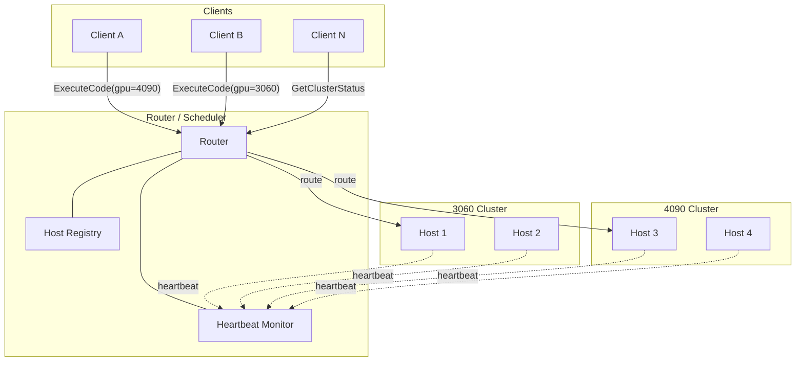

# Migration: Single Host → Distributed GPU Cluster

This document is the **phased roadmap** for evolving ferris-compute-cuda from a **single direct client → host** setup into a **distributed, multi-cluster** system: GPU-type-aware routing, a central router/scheduler, host heartbeats with telemetry, concurrent clients from anywhere, and (later) **vertical scaling** (many GPUs per machine).

**Related:** [common-protocol.md](common-protocol.md) (current proto), [client-cli.md](client-cli.md), [host-engine.md](host-engine.md).

---

## Current State

Single direct connection: **Client → gRPC → Host**. One service (`CUDAExecutor`), one host, effectively one GPU in status reporting. No routing, no cluster registry, no health aggregation.

---

## Target Architecture



**New crate:** `crates/router` — central scheduler / reverse-proxy: receives client RPCs, maintains a host registry, routes `ExecuteCode` to a matching healthy host, monitors heartbeats.

---

## Phase 0: Proto + Common Foundation

Extend [`crates/common/proto/compute.proto`](/crates/common/proto/compute.proto) with new types and a second service. Below are **concrete examples** (field numbers may shift when merged with the existing file; treat as the intended shape).

### `GpuType` and supporting messages

```protobuf
enum GpuType {
  GPU_UNSPECIFIED = 0;
  RTX_3060 = 1;
  RTX_3070 = 2;
  RTX_3080 = 3;
  RTX_4060 = 4;
  RTX_4070 = 5;
  RTX_4080 = 6;
  RTX_4090 = 7;
  A100     = 8;
  H100     = 9;
}

message HostInfo {
  string host_id = 1;
  string address = 2;       // e.g. "10.0.1.5:50051"
  GpuType gpu_type = 3;
  uint32 gpu_count = 4;     // >= 1, future vertical scaling
}

message Heartbeat {
  string host_id = 1;
  repeated GpuTelemetry gpus = 2;  // per-GPU metrics
  uint32 active_jobs = 3;
  uint64 uptime_secs = 4;
}

message GpuTelemetry {
  uint32 gpu_index = 1;
  string gpu_name = 2;
  GpuType gpu_type = 3;
  uint32 temperature_celsius = 4;
  uint32 memory_used_mb = 5;
  uint32 memory_total_mb = 6;
  uint32 load_percentage = 7;
}

message HeartbeatAck { bool accepted = 1; }

message RegisterRequest { HostInfo info = 1; }
message RegisterResponse { bool accepted = 1; string message = 2; }

message ClusterStatus { repeated HostStatus hosts = 1; }
message HostStatus {
  HostInfo info = 1;
  string health = 2;          // HEALTHY | DEGRADED | DEAD
  repeated GpuTelemetry gpus = 3;
  uint32 active_jobs = 4;
}
```

### Extend `ComputeRequest`

Add a client preference for GPU class (router uses it for scheduling):

```protobuf
message ComputeRequest {
  map<string, string> files = 1;
  string entry_point_file = 2;
  repeated string compiler_flags = 3;
  GpuType preferred_gpu = 4;  // NEW: client preference
}
```

### New service: `FerrisRouter` (router-side)

```protobuf
service FerrisRouter {
  rpc RegisterHost(RegisterRequest) returns (RegisterResponse);
  rpc SendHeartbeat(Heartbeat) returns (HeartbeatAck);
  rpc ExecuteCode(ComputeRequest) returns (stream ComputeResponse);  // proxied
  rpc GetClusterStatus(Empty) returns (ClusterStatus);
}
```

**Compatibility:** Keep existing `CUDAExecutor` on hosts; the router calls hosts via `CUDAExecutor.ExecuteCode` internally.

---

## Phase 1: Router Crate — Core Scheduling

Create `crates/router/`:

| Piece | Role |
|-------|------|
| **Host registry** | Shared state (e.g. `Arc<RwLock<HashMap<host_id, HostEntry>>>` or `DashMap`) |
| **`RegisterHost`** | Add/update registered hosts |
| **`SendHeartbeat`** | Refresh telemetry + timestamps → HEALTHY |
| **Reaper task** | Periodic: mark DEAD if heartbeat missing beyond threshold |
| **`ExecuteCode`** | Select healthy host matching `preferred_gpu` (round-robin or least-loaded), open `CudaExecutorClient`, **proxy** server stream to client |
| **`GetClusterStatus`** | Snapshot of registry + health |

**Auth (initial):** Router validates client token; forward token to hosts or use a dedicated internal token — refine in a later iteration.

**Rust learning hooks:** `Arc<RwLock<_>>` for shared registry across tasks; stream proxying via `mpsc` + `ReceiverStream` (same idea as the host today).

---

## Phase 2: Host — Registration + Heartbeat

Changes in host (`crates/host`):

- CLI: `--router`, optional `--host-id`, `--gpu-type` or auto-detect from `nvidia-smi`.
- **Startup:** `RegisterHost` to router.
- **Background loop:** every ~10s, collect telemetry (extend to all GPUs in Phase 5), send `Heartbeat`, track `active_jobs`.
- **Shutdown:** optional deregister on `SIGTERM` / Ctrl+C (`tokio::signal`).
- Host still listens for **direct** `CUDAExecutor` from the router.

---

## Phase 3: Client — GPU Type + Router Entry

Changes in client (`crates/client`):

- **`--gpu-type`** on `run` → sets `preferred_gpu` (optional = “any”).
- **Server URL** semantics: primary target becomes **router**; keep **direct host** mode for local dev.
- **`run`:** call router’s `FerrisRouter.ExecuteCode` when in cluster mode.
- **`status`:** optional cluster view via `GetClusterStatus`, grouped by GPU type.

Example CLI output shape (illustrative):

```text
--- Cluster Status ---
RTX 4090 (2 hosts, 1 healthy, 1 degraded)
  host-abc  48°C  12/24 GB  35% util  2 jobs
  host-xyz  85°C  23/24 GB  98% util  5 jobs  [DEGRADED]
RTX 3060 (1 host, 1 healthy)
  host-def  42°C   4/12 GB  10% util  0 jobs
```

- **Discovery:** advertise / discover routers (e.g. `_ferris-router._tcp.local.`) in addition to hosts if desired.

---

## Phase 4: Admin / Observability

On the router (e.g. `axum` beside gRPC):

- `GET /health` — router liveness
- `GET /api/cluster` — JSON cluster status
- Optional: small web UI for hosts, GPU util, health transitions

Use **structured logging** (`tracing`) for routing decisions and health state changes.

---

## Phase 5: Vertical Scaling (≥ 8 GPUs per Host)

- Parse **all** `nvidia-smi` rows (today: first row only).
- Assign jobs per GPU: `CUDA_VISIBLE_DEVICES=N` for compile/run.
- Host-local scheduler: track busy/free GPUs; router may use `gpu_count` for capacity hints.
- `Heartbeat.gpus` already supports per-GPU telemetry for the admin view.

---

## File / Crate Impact (Checklist)

| Area | Action |
|------|--------|
| `crates/common/proto/compute.proto` | Enum, messages, `FerrisRouter`, `ComputeRequest` field |
| `crates/router/` | **New** — registry, scheduler, proxy, optional HTTP |
| `crates/host/` | Register, heartbeat, job counter, multi-GPU (Phase 5) |
| `crates/client/` | `--gpu-type`, router vs direct, cluster status |
| `docs/changelog/` | Numbered entry when implementation starts |
| This doc | Living design reference; update as decisions land |

---

## Delivery Order

Each phase can ship **incrementally** without breaking the previous model:

1. Proto + router skeleton (hosts unchanged for direct clients).
2. Hosts register + heartbeat; clients still optional direct.
3. Client defaults to router with GPU type; direct remains fallback.
4. HTTP admin / dashboard.
5. Multi-GPU scheduling on host (client protocol can stay the same).

---

## Suggested Dependencies (When Implementing)

- **Router:** `tonic`, `tokio`, `clap`, `tracing`, optional `axum`, optional `dashmap`
- **Host:** `tokio::signal`, `tracing`

No build or code changes are implied by **this document alone** — it is the architecture migration plan on disk.
